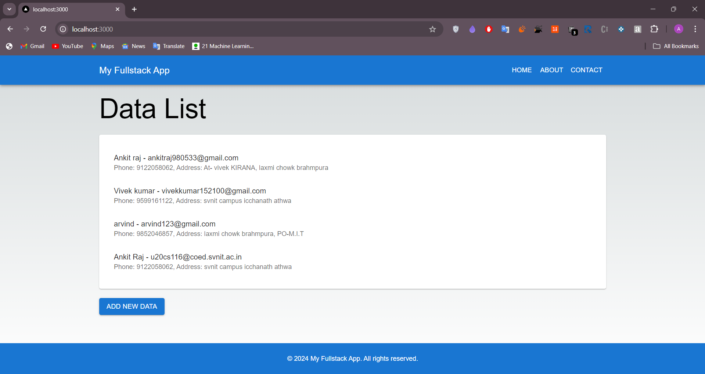
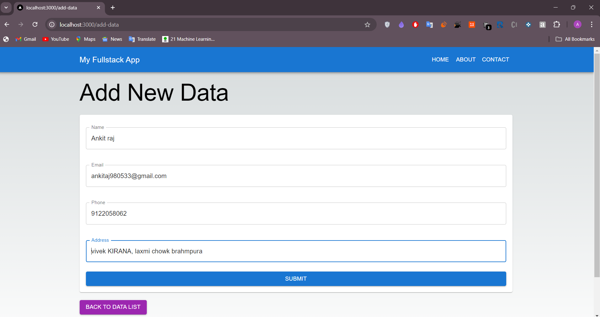
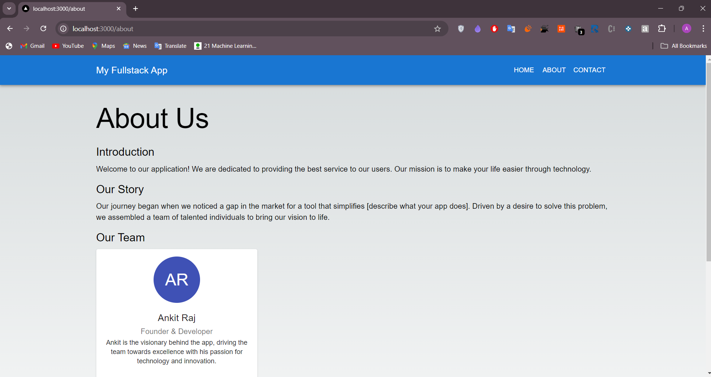
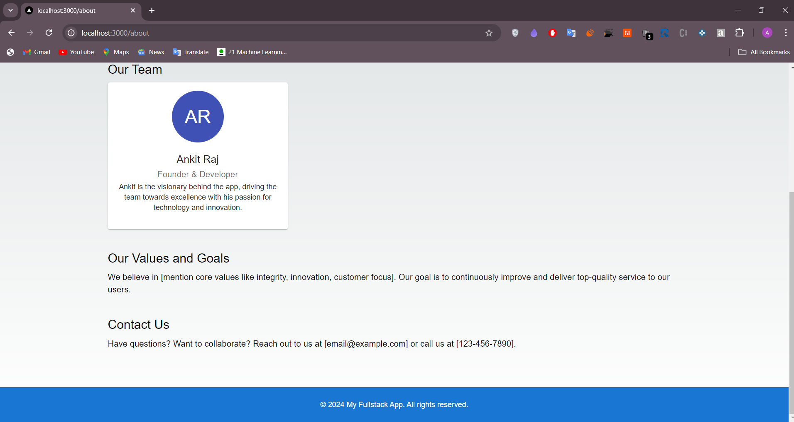

# Full-Stack Data Management Application

This full-stack application allows users to manage and display data through a user-friendly interface. It includes a React frontend and an Express backend, connected to a MongoDB database.

## Features

- **Add New Data**: Users can submit new data entries through a form.
- **View Data**: Display a list of all submitted data entries.
- **Responsive Design**: Optimized for both desktop and mobile devices.
- **Navigation**: Easy navigation between different pages of the application.

## Technologies Used

- **Frontend**: React, Next.js, Material UI, Formik, Yup
- **Backend**: Node.js, Express, MongoDB, Mongoose
- **Deployment**: MongoDB Atlas for cloud database hosting

## Installation

### Prerequisites

- Node.js (v14.x or higher)
- npm (v6.x or higher)
- MongoDB Atlas account (for database hosting)

### Frontend

1. Navigate to the `frontend` directory:

   ```bash
   cd frontend

2. Install dependencies:

   ```bash
   npm install

### Backend
1. Navigate to the backend directory:

    ```bash
    cd backend

2. Install dependencies:

    ```bash
    npm install

## Running the Application

To start both the frontend and backend concurrently from the root folder, follow these steps:

1. **Navigate to the root directory** (where both `frontend` and `backend` folders are located):

   ```bash
   cd path/to/your/root/directory

2. Run the application:

   ```bash
   npm start

This command will run both the frontend and backend servers simultaneously:

Frontend: Available at http://localhost:3000

Backend: Available at http://localhost:5000

### Data List Page



### Add New Data Page



### About Page (1)



### About Page (2)




## Contact

For any inquiries or issues, please contact:

- **Email**: [ankitraj98055@gmail.com](mailto:ankitraj98055@gmail.com)
- **Phone**: +91-9122058062
